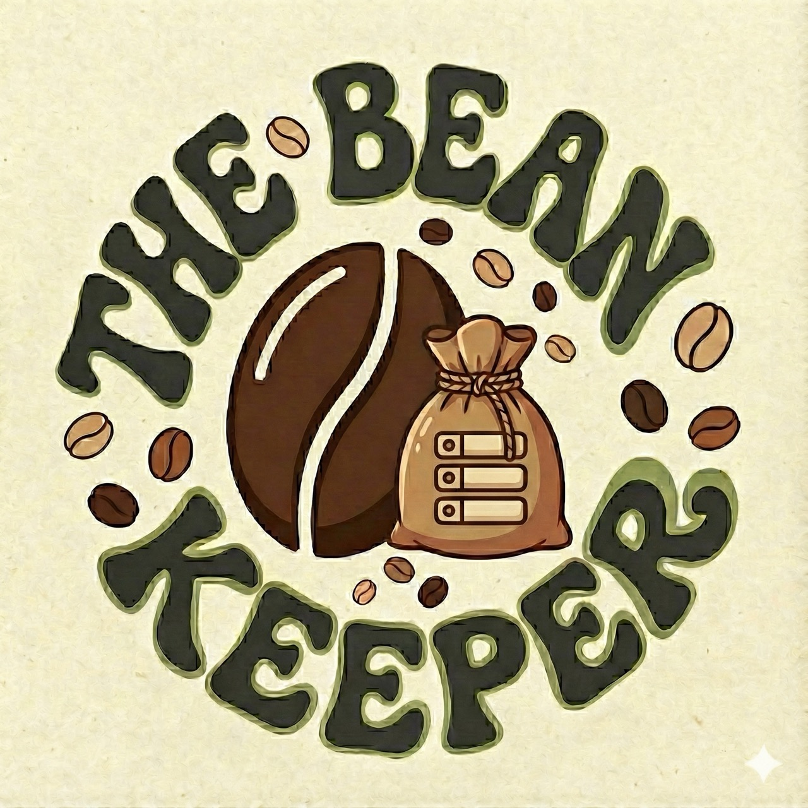

# ☕ The Bean Keeper

[](https://www.python.org/downloads/)
[](https://fastapi.tiangolo.com/)
[](https://www.uvicorn.org/)
[](https://docs.pytest.org/)
[](./LICENSE)

A mobile-first coffee tracking application that uses AI and OCR to automatically extract coffee information from bag labels.



## 🌟 Features

- 📸 **AI-Powered Extraction**: Upload coffee bag photos → Groq AI (Llama 3.1 8B) automatically extracts roaster, origin, variety, process method, and more
- 🌍 **Bilingual Interface**: Full support for English and Traditional Chinese (繁體中文)
- 🔍 **Advanced Filtering**: Filter by roast level, rating, origin with dynamic sort options
- 📊 **Collection Statistics**: Track your coffee journey with insights and analytics
- ⭐ **Rating System**: 5-star ratings with tasting notes
- 🗺️ **Auto-Generated Maps**: Google Maps links for every roaster
- 📱 **Mobile-Optimized**: Dual photo upload (camera + file picker), responsive design
- ☕ **Vintage Aesthetic**: Coffee journal-inspired design with warm brown color palette

## 🚀 Demo Video 

(![Link here] (https://res.cloudinary.com/dog6jqdmz/video/upload/v1769561616/bean-keeper-demo-v1_mgiyst.mp4))

## 🛠️ Tech Stack

### Frontend
- React 18 + TypeScript + Vite
- TanStack Query (React Query)
- Wouter (routing)
- shadcn/ui + Tailwind CSS
- Tesseract.js (OCR)
- i18next (internationalization)

### Backend
- Express.js + TypeScript
- Groq AI (Llama 3.1 8B Instant)
- Notion SDK (database)
- Render.com Web Services
- Claudinary Cloud Storage (photos)

### AI/ML Pipeline
1. User uploads coffee bag photo
2. Tesseract.js extracts text (client-side)
3. Groq AI structures the data (server-side)
4. Form auto-fills with extracted information
5. User reviews and saves to Notion

## 📦 Quick Start

### Prerequisites
- Node.js 18+
- Groq API key ([groq.com](https://groq.com))
- Notion Internal Integration ([notion.so/my-integrations](https://notion.so/my-integrations))
- Google Maps API key (optional)

### Installation

```bash
# Clone the repository
git clone https://github.com/yourusername/the-bean-keeper.git
cd the-bean-keeper

# Install dependencies
npm install

# Copy environment variables
cp .env.example .env
# Edit .env with your API keys

# Run development server
npm run dev
```

Visit `http://localhost:5000`

## 🔑 Environment Variables

Create a `.env` file with:

```env
# Required
GROQ_API_KEY=your_groq_api_key
NOTION_API_KEY=your_notion_internal_integration_token
NOTION_DATABASE_ID=your_notion_database_id

# Optional
VITE_GOOGLE_MAPS_API_KEY=your_google_maps_key
PORT=5000
```

See [`.env.example`](.env.example) for details.

## 🗄️ Database Setup

### Option 1: Create Notion Database Automatically

```bash
# Create a page in Notion and get its ID
# Then run:
npx tsx create-database.ts <notion-page-id>
```

### Option 2: Manual Setup

See [`NOTION_DATABASE_STRUCTURE.md`](NOTION_DATABASE_STRUCTURE.md) for the complete schema.

## 📱 Deployment

### Deploy to Render (Free)

Full deployment guide: [`DEPLOYMENT.md`](DEPLOYMENT.md)

Quick start: [`DEPLOY_QUICK_START.md`](DEPLOY_QUICK_START.md)

```bash
# 1. Push to GitHub
git add .
git commit -m "Ready for deployment"
git push

# 2. Create web service on Render
# 3. Connect GitHub repository
# 4. Add environment variables
# 5. Deploy!
```

Auto-deploys on every `git push` to main branch.

## 🧪 Development

```bash
# Development server
npm run dev

# Type checking
npm run check

# Production build
npm run build

# Production server
npm start

# Test Groq AI extraction
npx tsx test-groq.ts

# Test Notion connection
npx tsx test-notion-setup.ts
```

## 📸 Screenshots

### Dashboard
Mobile-first grid layout with Instagram-style coffee cards

### AI Extraction
Upload photo → AI extracts roaster, origin, variety, process, roast level

### Bilingual Support
Toggle between English and Traditional Chinese

### Statistics
Track your coffee journey with collection insights

## 🗂️ Project Structure

```
The-Bean-Keeper/
├── client/                 # React frontend
│   ├── src/
│   │   ├── components/    # UI components
│   │   ├── pages/         # Page components
│   │   ├── i18n/          # Translations (EN/ZH)
│   │   └── lib/           # API client
│   └── public/            # Static assets
├── server/                # Express backend
│   ├── index.ts           # Server entry
│   ├── routes.ts          # API endpoints
│   ├── groq.ts            # Groq AI client
│   ├── notion.ts          # Notion operations
│   └── notion-storage.ts  # Storage layer
├── shared/                # Shared types
│   └── schema.ts          # TypeScript + Zod schemas
├── DEPLOYMENT.md          # Full deployment guide
├── DEPLOY_QUICK_START.md  # Quick deployment steps
└── CLAUDE.md              # Development guide
```

## 🎨 Key Features Detail

### AI-Powered Extraction
- **OCR**: Tesseract.js extracts raw text from photos
- **AI Processing**: Groq Llama 3.1 8B structures the data
- **Smart Detection**: Automatically identifies roast level, origin, variety
- **Graceful Fallback**: Regex extraction if AI fails

### Internationalization
- Full bilingual support (EN + ZH 繁體中文)
- Automatic language detection
- LocalStorage persistence
- 6 translation namespaces

### Mobile-First Design
- Responsive 2-5 column grid
- Dual photo upload methods
- Touch-optimized interactions
- Vintage coffee journal aesthetic

### Collection Management
- Advanced filtering (roast, rating, origin)
- Multiple sort options
- Duplicate detection
- Statistics dashboard

## 🤝 Contributing

This is a portfolio project, but suggestions are welcome!

## 📄 License

MIT License - See [LICENSE](LICENSE) file for details

## 👨‍💻 Author

**Ophelia Chen**
- Portfolio: Coming Soon
- LinkedIn: https://www.linkedin.com/in/opheliandata/
- GitHub: @YFC-ophey

## 🙏 Acknowledgments

- [Claude Code](https://claude.ai/code) - My Fav Vibe Coding Tool
- [Groq](https://groq.com) - Lightning-fast AI inference
- [Notion](https://notion.so) - Database and API
- [Tesseract.js](https://tesseract.projectnaptha.com/) - OCR engine
- [shadcn/ui](https://ui.shadcn.com/) - UI components
- [Clash Display](https://www.fontshare.com/fonts/clash-display) - Typography
- [Render](https://render.com/) - Cloud Application Platform
- [Cloudinary](https://cloudinary.com/) - Image and Media API Platform

---

**Built with ☕ and AI** | Powered by Groq + Notion
